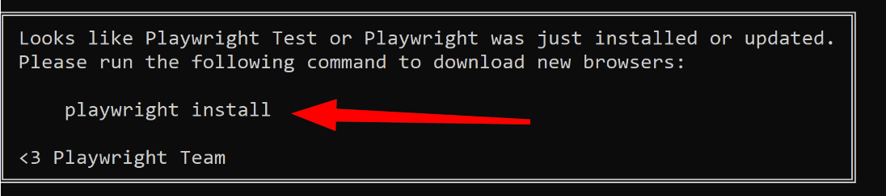

### Homework 5
- Update your local branch 'main';
- Create new branch (e.g., homework-5);
- Go to **ui** directory and run the command 'yarn';
- To run the tests, run the command 'yarn test';
- If, when running tests, a similar error is printed in the console, simply execute the hint command from the block  (e.g. 'npx playwright install' or same);
- Create a new file UHC-1.test.ts in the **ui/tests** directory.  **ATTENTION!** The test name **must** contain the part .test. Without it, Playwright will not see the test at startup;
- Automate test steps 1-3 from the provided test case.  You can take the test structure from **ui/tests/UHC-0.test.ts**.